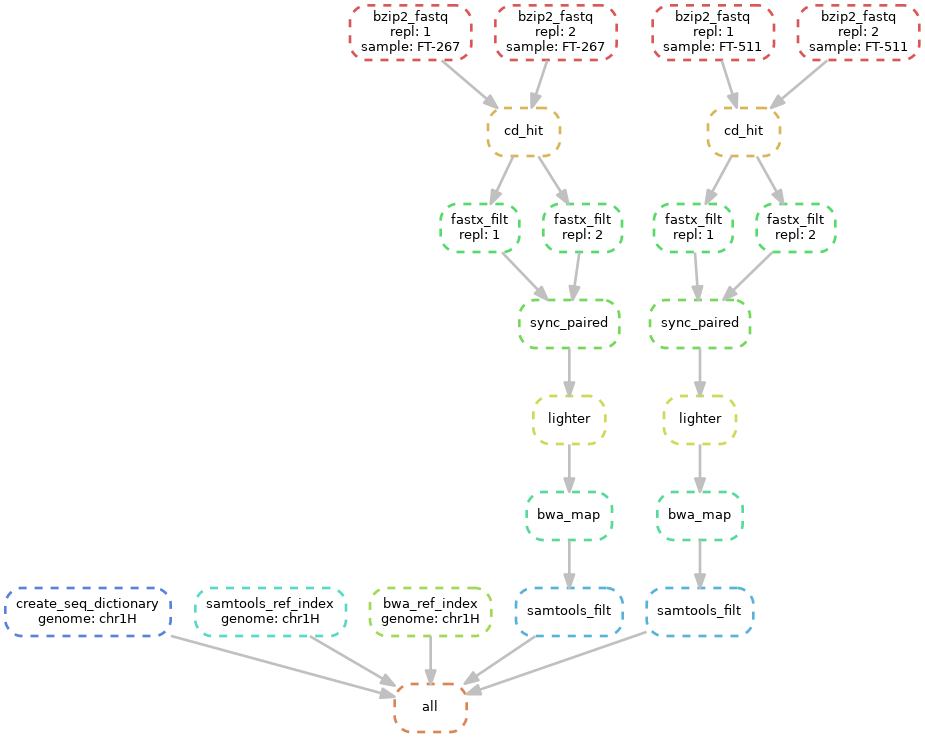

========================================
Bash and Snakemake pipelines for generating high-quality VQSR-filtered SNP and INDEL calls
========================================

.. contents:: **Table of Contents**

BASH pipeline
========================================

(1) run launch_filtering_mapping.sh - runs the initial checks and launches filtering_mapping_rawcalling.bsub (requires LSF system) \
(2) after all the bsub jobs are finished, run merge_UG.sh and genotypegvcf.sh \
(3) run ug_genotyping.bsub (requires LSF system) \
(4) after all bsub jobs are finished, run merge_UG1.sh \
(5) run filtering_vsqr.sh

Snakemake pipeline
========================================

*if on LSF cluster, launch as "sh scripts/submit_lsf.sh; adjust required and available resources in cluster.yaml*

(1) install conda (https://conda.io/projects/conda/en/latest/user-guide/install/index.html) \
(2) create conda environment (conda-env create --file environment.yaml) \
(3) activate conda environment (conda-env activate snakemake_read_vcf) \
(4) create data/ folder with required files (reference genome fasta; input fq.bz2 files)
\
Workflow:

