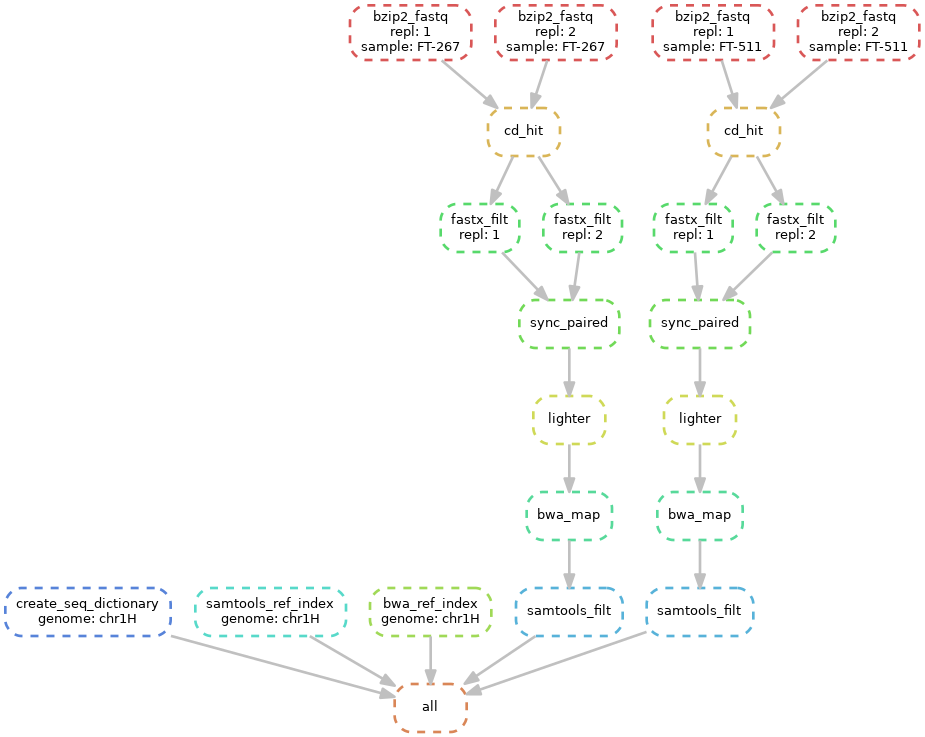

Snakemake pipeline
========================================

*if on LSF cluster, launch as "sh scripts/submit_lsf.sh; adjust required and available resources in cluster.yaml*

(1) install conda (https://conda.io/projects/conda/en/latest/user-guide/install/index.html) \
(2) create conda environment (conda-env create --file environment.yaml) \
(3) activate conda environment (conda-env activate snakemake_read_vcf) \
(4) create data/ folder with required files (reference genome fasta; input fq.bz2 files)\

